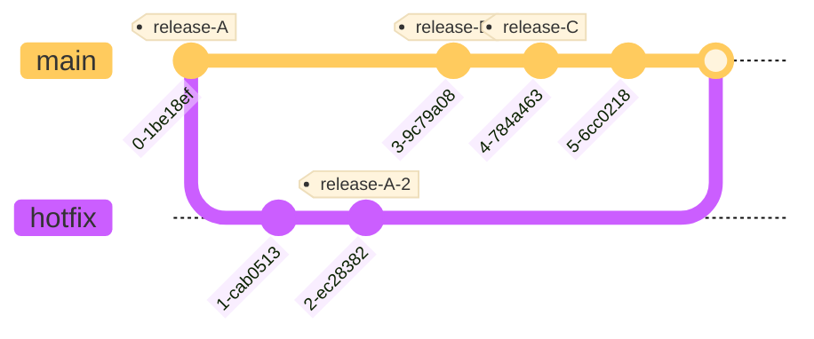
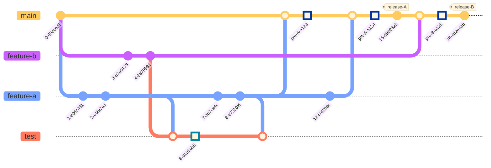

## 研发编码规范

#### 产品-应用关系描述

- 产品是进行`缺陷管理`、`需求管理`的最小单位
    - 按照业务线作区分
- 应用是进行`代码开发`的最小单位
    - 一个应用对应一个代码仓库

产品与应用为一对多的关系，即一个产品有多个应用。

产品具有以下基本属性
- displayName 显示名称（中文名称，仅做显示之用）
- name        英文全称
- perfix      前缀（5个字符以内）

应用具有以下基本属性
- displayName 显示名称（中文名称，仅做显示之用）
- name        英文全称（默认为Maven工件Id）
- simpleName  简短名称（14个字符以内）


### 命名规则

#### 项目命名规则
1. Maven项目名：（由脚手架自动生成）
    - 项目名(`artifactId`)统一使用小写，以中划线`-`作为分隔符
    - API模块的`artifactId`应该以`-api`结尾
    - 应用模块如果与API包在同一个仓库中，则`artifactId`应以'-biz'结尾。
    - 应用模块位于单独的代码仓库中，则`artifactId`无需添加后缀。

2. Java单体项目名规则： `<语言>-<业务名称>-<项目类型>`
    - 语言
        - java
        - php
        - node
    - 业务名称
        - auth
        - product
        - resource-center
    - 项目类型
        - cloud
        - boot
```text

单体项目
java-xxxxx-cloud
java-xxxxx-cloud-api

聚合项目
ng-xxxxx
  |- ng-xxxxx-api
  |- ng-xxxxx-biz
```
2. Maven GroupId必须满足以下正则表达式
    - `^com.kailin.*`


#### 类命名规则

| 功能 | 后缀 | 例子 | 备注 | 
 | ---- | ---- | ---- | ---- |  
| 表名 | - | user_detail | 表名仅做建议，根据业务可自行添加前缀后缀 | 
| 复合实体 | - | UserDetail | 简单CRUD场景下，用于代替领域对象、数据对象的功能</br><b>无法替代DTO和VO</b> | 
| 领域对象 | Domian | UserDetailDomain | 胖实体，拥有业务上的方法，无法从数据库直接得到，</br></br>简单CRUD无需领域对象/复合实体的，可与DO混用 | 
| 数据对象 | DO | UserDetailDO | 从数据库中直接查询得到的对象，一般会类上存在ORM相关的注解</br></br>简单CRUD场景下可用复合实体/领域对象代替 | 
| 数据传输对象 | DTO | UserDetailDTO | 一般是放在Api包中提供出去 | 
| 用与前端展示的POJO类 | VO | UserDetailVO | -  | 
| 数据库映射接口 | Mapper | UserMapper | Mybatis用 | 
| 数据库映射接口 | Repository | UserRepository | JPA用 | 
| 数据Service接口 | IService | UserDetailIService | 使用MybatisPlus时，用于区分`业务Service`和`数据Service` | 
| 数据Service实现 | IServiceImpl | UserDetailIServiceImpl | - | 
| Service接口 | Service | UserDetailService | 真实提供业务的Service接口 | 
| Service实现 | ServiceImpl | UserDetailServiceImpl | - | 
| web接口 | Controller | UserDetailController | - | 
| web接口入参 | Param | UserDetailParam | 执行特定业务时所需的入参 | 
| web接口查询复合参数 | Query | UserDetailQuery | 【仅建议】执行特定查询时所用的<b>查询</b>参数 | 
| 工具类 | Utils | DateUtils | 一个工具类是一个工具集，因此用复数 </br><b>自己编写工具类之前先看看项目内已引入工具能不能满足需求</b></br>使用优先顺序为 commons.lang3 > hutool > spring > 自己编写 | 
| 常量类 | Constants | UserTypeConstants | 一个常量类中含有多个常量，因此用复数 | 
| 枚举类 | Enum | UserTypeEnum | 枚举不是一个集合，而是一个类型定义， | 

#### 数据访问层命名规则

##### 接口方法规范（参照JPA规范）
- 使用`get`、`find`、`list`、`stream`、`update`、`save`、`delete`作为前缀
- 使用`By`、`OrderBy`、`GroupBy`作为谓词
- 方法命名规则： `<前缀><实体名or字段名><谓词1><字段名1><谓词2><字段名2>`
- 当查询结果为实体时，实体名可省略：
    - 如`getUserById()`省略实体名为`getById()`
- 当查询结果为实体的派生对象时时，实体名可省略为后缀：
    - 如`getUserVOById()`省略实体名为`getVOById()`
- 当查询结果为字段名或者特定对象时，不可省略
    - 如`getPasswordById()`无法省略
    - 如`getLoginSlatAndPasswordById()`无法省略

##### 前缀规范
1. 获取单个对象的方法用 get 做前缀时，返回`T`或者`null`。
    - 如： `UserDetailDO getUserDetailById()`;
1. 【推荐】获取单个对象的方法用 find 做前缀时，返回`Optional<T>`。
    - 如： `Optional<UserDetailDO> findUserDetailByName()`。
    - 如： `Optional<UserDetailDO> findUserDetailByName()`。
2. 获取多个对象的方法用 list 做前缀时，实体采用复数结尾，返回`<? extend Collection><T>`即Collection的子类
    - 如： `List<UserDetailDO> list()`(省略对象名)。
    - 如： `List<UserDetailDO> listUserDetails()`。
    - 如： `Set<UserDetailDO> listUserDetailsByCreateTime(Date createTime)`。
    - 如： `Queue<UserDetailDO> listUserDetailsByAge(Long age)`。
2. 【推荐】获取多个对象的方法用 stream 做前缀时，实体采用复数结尾，返回`Stream<T>`
    - 如： `Stream<UserDetail> stream()`(省略对象名)。
    - 如： `Stream<UserDetail> streamUserDetails()`。
2. 分页查询对象的方法用 page 做前缀，复数结尾。
    - 如： `Page<UserDetail> pageUserDetails(PageParam param)`。
4. 统计总数的方法用 count 做前缀。
    - 如： `Long countByAge(Long age)`。
5. 插入的方法用 save 做前缀。 返回保存的实体.
    - 如： `UserDetailDO save(UserDetailDO saveDO)`。
6. 删除的方法用 delete 做前缀。返回受影响行数。
    - 如： `Long deleteById(String id)`。
7. 修改的方法用 update 做前缀。批量修改时返回受影响行数，单个值修改时返回修改后实体。
    - 如： `UserDetailDO|Long updateById(UserDetailDO updateDO)`。
    - 如： `Long updateByCreateTime(UserDetailDO updateDO,Date createTime)`。
8. 执行特定操作的方法使用其操作名做前缀。如： sendSms 发送短信，noticeUser 通知用户，uploadPic 上传图片，downloadFile 下载文件

#### 数据库命名规则
1. 数据库库名命名规则：`<产品前缀>_<应用简称>`命名
    - 如`ng_kboss_auth`，其中`ng_kboss`为产品前缀，`auth`为应用简称。
    - 如`hneduexam`应修改为`hn_edu_exam`，其中`hn_edu`为产品前缀，`exam`为应用简称。
1. 表名和字段名均采用小写，以下划线分隔，如`collection_account`、`edu_report_operate_loss_record`
2. 如果手动建索引，名称需要使用`idx_<表名/表名首字母简写>_<字段名>`的模式
3. 数据库中遇到时间字段，需要使用`datetime(3)`类型,否则会查询时会存在舍入问题
3. 请注意：业务状态字段和软删除字段需要分离，即`is_delete`字段不能进行业务控制
4. 公共命名规范如下表
   | 字段名 | 类型 | 空/默认值 | 描述 | 备注 |
   | ---- | ---- | ---- |---- | ---- |  
   | is_delete | tinyint(4) | DEFAULT '0' | 软删除字段(0 未删除 1 已删除) | - |
   | create_time | datetime(3) |  DEFAULT CURRENT_TIMESTAMP  |创建时间 | - |
   | update_time | datetime(3) | DEFAULT CURRENT_TIMESTAMP</br>ON UPDATE CURRENT_TIMESTAMP | 更新时间 | - |
   | create_user_id | varchar(32) | DEFAULT NULL | 创建者id | 非必需，视业务而定 |
   | create_user_name | varchar(255) | DEFAULT NULL | 创建者名称 | 非必需，视业务而定 |
   | update_user_id | varchar(32) | DEFAULT NULL | 修改者id | 非必需，视业务而定 |
   | update_user_name | varchar(255) | DEFAULT NULL | 修改者名称 | 非必需，视业务而定 |

### 编码规则
<!-- 
1. 禁止在POJO互相转换时使用`BeanUtils.copyProperties()`或其他自动拷贝属性值的工具，领域模型之间的字段对应关系需要手动维护。
    - 使用属性拷贝工具会使得频繁修改字段时，字段的维护变得困难。并且多次重复拷贝会带来大量隐蔽的bug并消耗更多的性能。
 -->
2. 尽量避免使用`java.sql.Date`，应使用`java.util.Date`

3. 尽量避免止将`SimpleDateFormat`等线程不安全的类定义为静态变量。如果定义为 static，必须加锁。

### 代码开发以及分支规范

#### 分支类型
- 主分支，唯一主分支为`master`
- 功能分支，实际进行开发时，开发人员实际编写的分支，以`feature/<功能名称>`命名
- 热修复分支，从某个发布分支迁出，完成修复后合并回发布分支和主分支，以`hotfix/<release分支版本号>/<需要修复的功能>`命名

#### 版本命名规则


|  |  | 命名规则 |
| --- | --- | --- |
| Maven工件  | Artifact Version | `<框架版本>/<功能版本>/<修订版本>` </br> <ul><li>框架版本: 框架变更时+1</li><li>功能版本: 功能迭代时+1  (累加，不清零)</li><li>修订版本: 修复BUG时+1   (累加，不清零)</li></ul> |
| 功能分支 | Branch Name | `feature/<Feature Name>-<Date yyyyMMdd>` |
| 测试分支 | Branch Name | `test/<Date yyyyMMdd>/<Feature A>/<Feature B>` |
| 热发布分支 | Branch Name | `hotfix/<Feature A>/` |
| 发布标签（单体项目） | Release Tag | `<Artifact Version>` |
| 发布标签（聚合项目） | Release Tag | `<Artifact Name>/<Artifact Version>` |

#### 分支流程介绍


#### 分支介绍

分支类型：
- 主分支，唯一主分支为`master`
- 功能分支，实际进行开发时，开发人员实际编写的分支，以`feature/<功能名称>`命名
- *测试分支，所有含有`test/`前缀的分支都为测试分支，以`test/<对应功能分支的名称>`命名
 <!-- - 热修复分支，从某个发布分支迁出，完成修复后合并回发布分支和主分支，以`hotfix/<release分支版本号>/<需要修复的功能>`命名 -->

##### 主分支 `master`

对应环境:
- `预发布环境-pre`
- `*生产环境-prod`

生命周期:
- 永久有效

分支特征:
- 该分支受到保护，无法直接通过push提交代码，仅仅可通过合并PullRequest更新
- 该分支的代码一定是 **可用的** 代码，随时随地都可以通过流水线完成构建
- 线上的应用一定是通过主分支打包得到的
- 主分支上的代码**不一定**与线上代码一致
- 开发人员**无需**在本地建立同名分支以跟踪master

##### （可选）公共测试分支 `test`

建议命名规范: `test\<Date yyyyMMdd>\<功能名称A>\<功能名称B>`

对应环境:
- `测试环境-test (功能测试-多分支)`

生命周期:
- 当多个功能需要并行进行测试时，从任一feature分支中迁出，并merge所有需要测试的分支
- 当功能均测试完成或仅剩一个功能后，可以删除此分支

分支特征:
- 该分支用于支持同一项目同时开发、测试多个新功能
- 同一个项目串行进行开发任务时，此分支无需存在，直接由feature分支代替本分支功能
- 由于pre测试并不在本分支上运行，所以pre环境做出的改动不会应用到本分支上，本分支的代码不一定准确，非必要不使用本分支做测试
- 该分支仅进行功能测试
- 该分支**禁止**反向合并到其他**任何**分支

##### 功能分支 `feature/<功能名称>-<Date yyyyMMdd>`

对应环境:
- `开发环境-dev`
- `测试环境-test (功能测试-单分支)`

生命周期:
- 当开发人员接到开发任务并完成任务拆解后，根据具体的任务创建功能分支
- 当该功能完成发布，顺利上线并创建`release`分支后，该功能分支应该被删除

分支特征:
- 该分支**必须**也**只能**从`master`分支签出
- 该分支的代码一定是 **最新的** 代码，由**开发人员**自行开发和维护
- 使用该分支的开发人员**必须**在`上班前`和`下班前`从`master`拉取并合并代码
- 拉取`master`发生代码冲突时，如非特意更改，应以`master`分支代码为准
- 当测试人员使用此分支进行**功能测试**

##### 热发布分支 `hotfix/<release分支版本号>/<需要修复的功能>`

对应环境:
- `生产环境-prod`

生命周期:
- 当生产环境出现bug时，由`开发人员`从对应的`Release Tag`中签出
- 当该bug修复完成后:
    - 移动签出的`Release Tag`到当前分支
    - 将该分支并入`master`分支中
    - 删除热发布分支

分支特征:
- 该分支由**开发人员**新建，只能从对应的`Release Tag`中签出
- 该分支的代码一定是 **准确的** **可用于生产的** 代码，可以随时进行打包上线
- 该分支应始终**落后或等同**于`master`分支

### 分支管理 GitGraph

#### 图例
 - 方块形状节点： 测试提测节点
 - 中空圆形节点： 由merge产生的commit节点
 - 被标签标记的节点： 实际生产上线的节点

#### 最简流程

  <p>同时仅有一个功能进行开发时的最简流程，无需test分支，且无pre环境。</p>
  <div class="mermaid">
    %%{init: { 'logLevel': 'debug', 'theme': 'base' ,'startOnLoad': true } }%%
    gitGraph
    commit
    branch feature-a
    commit
    commit type:HIGHLIGHT
    commit type:HIGHLIGHT
    checkout main
    merge feature-a
    commit tag:"release-A"

  </div>

#### Hotfix流程
  <p>生产上线后出现重大Bug需要进行线上修复的流程。</p>


#### 多功能并行开发流程
  <p>同时有多个功能进行并行开发时的的复杂管理流程，需要借助一个不可信的临时test分支同时进行多个功能的测试。</p>
